# Projects and dependencies analysis

This document provides a comprehensive overview of the projects and their dependencies in the context of upgrading to .NETCoreApp,Version=v10.0.

## Table of Contents

- [Executive Summary](#executive-Summary)
  - [Highlevel Metrics](#highlevel-metrics)
  - [Projects Compatibility](#projects-compatibility)
  - [Package Compatibility](#package-compatibility)
  - [API Compatibility](#api-compatibility)
- [Aggregate NuGet packages details](#aggregate-nuget-packages-details)
- [Top API Migration Challenges](#top-api-migration-challenges)
  - [Technologies and Features](#technologies-and-features)
  - [Most Frequent API Issues](#most-frequent-api-issues)
- [Projects Relationship Graph](#projects-relationship-graph)
- [Project Details](#project-details)

  - [Data\AutoOglasi.Data.Common\AutoOglasi.Data.Common.csproj](#dataautooglasidatacommonautooglasidatacommoncsproj)
  - [Data\AutoOglasi.Data.Models\AutoOglasi.Data.Models.csproj](#dataautooglasidatamodelsautooglasidatamodelscsproj)
  - [Data\AutoOglasi.Data\AutoOglasi.Data.csproj](#dataautooglasidataautooglasidatacsproj)
  - [Infrastructure\AutoOglasi.CustomAttributes\AutoOglasi.CustomAttributes.csproj](#infrastructureautooglasicustomattributesautooglasicustomattributescsproj)
  - [Infrastructure\AutoOglasi.GlobalConstants\AutoOglasi.GlobalConstants.csproj](#infrastructureautooglasiglobalconstantsautooglasiglobalconstantscsproj)
  - [Infrastructure\AutoOglasi.MapperConfigurations\AutoOglasi.MapperConfigurations.csproj](#infrastructureautooglasimapperconfigurationsautooglasimapperconfigurationscsproj)
  - [Services\AutoOglasi.Services\AutoOglasi.Services.csproj](#servicesautooglasiservicesautooglasiservicescsproj)
  - [Web\AutoOglasi.Web.Constants\AutoOglasi.Web.Constants.csproj](#webautooglasiwebconstantsautooglasiwebconstantscsproj)
  - [Web\AutoOglasi.Web.ViewModels\AutoOglasi.Web.ViewModels.csproj](#webautooglasiwebviewmodelsautooglasiwebviewmodelscsproj)
  - [Web\AutoOglasi.Web\AutoOglasi.Web.csproj](#webautooglasiwebautooglasiwebcsproj)

## Executive Summary

### Highlevel Metrics

| Metric | Count | Status |
| :--- | :---: | :--- |
| Total Projects | 10 | 0 require upgrade |
| Total NuGet Packages | 25 | All compatible |
| Total Code Files | 150 |  |
| Total Code Files with Incidents | 0 |  |
| Total Lines of Code | 13526 |  |
| Total Number of Issues | 0 |  |
| Estimated LOC to modify | 0+ | at least 0,0% of codebase |

### Projects Compatibility

| Project | Target Framework | Difficulty | Package Issues | API Issues | Est. LOC Impact | Description |
| :--- | :---: | :---: | :---: | :---: | :---: | :--- |
| [Data\AutoOglasi.Data.Common\AutoOglasi.Data.Common.csproj](#dataautooglasidatacommonautooglasidatacommoncsproj) | net10.0 | ✅ None | 0 | 0 |  | ClassLibrary, Sdk Style = True |
| [Data\AutoOglasi.Data.Models\AutoOglasi.Data.Models.csproj](#dataautooglasidatamodelsautooglasidatamodelscsproj) | net10.0 | ✅ None | 0 | 0 |  | ClassLibrary, Sdk Style = True |
| [Data\AutoOglasi.Data\AutoOglasi.Data.csproj](#dataautooglasidataautooglasidatacsproj) | net10.0 | ✅ None | 0 | 0 |  | ClassLibrary, Sdk Style = True |
| [Infrastructure\AutoOglasi.CustomAttributes\AutoOglasi.CustomAttributes.csproj](#infrastructureautooglasicustomattributesautooglasicustomattributescsproj) | net10.0 | ✅ None | 0 | 0 |  | ClassLibrary, Sdk Style = True |
| [Infrastructure\AutoOglasi.GlobalConstants\AutoOglasi.GlobalConstants.csproj](#infrastructureautooglasiglobalconstantsautooglasiglobalconstantscsproj) | net10.0 | ✅ None | 0 | 0 |  | ClassLibrary, Sdk Style = True |
| [Infrastructure\AutoOglasi.MapperConfigurations\AutoOglasi.MapperConfigurations.csproj](#infrastructureautooglasimapperconfigurationsautooglasimapperconfigurationscsproj) | net10.0 | ✅ None | 0 | 0 |  | ClassLibrary, Sdk Style = True |
| [Services\AutoOglasi.Services\AutoOglasi.Services.csproj](#servicesautooglasiservicesautooglasiservicescsproj) | net10.0 | ✅ None | 0 | 0 |  | ClassLibrary, Sdk Style = True |
| [Web\AutoOglasi.Web.Constants\AutoOglasi.Web.Constants.csproj](#webautooglasiwebconstantsautooglasiwebconstantscsproj) | net10.0 | ✅ None | 0 | 0 |  | ClassLibrary, Sdk Style = True |
| [Web\AutoOglasi.Web.ViewModels\AutoOglasi.Web.ViewModels.csproj](#webautooglasiwebviewmodelsautooglasiwebviewmodelscsproj) | net10.0 | ✅ None | 0 | 0 |  | ClassLibrary, Sdk Style = True |
| [Web\AutoOglasi.Web\AutoOglasi.Web.csproj](#webautooglasiwebautooglasiwebcsproj) | net10.0 | ✅ None | 0 | 0 |  | AspNetCore, Sdk Style = True |

### Package Compatibility

| Status | Count | Percentage |
| :--- | :---: | :---: |
| ✅ Compatible | 25 | 100,0% |
| ⚠️ Incompatible | 0 | 0,0% |
| 🔄 Upgrade Recommended | 0 | 0,0% |
| ***Total NuGet Packages*** | ***25*** | ***100%*** |

### API Compatibility

| Category | Count | Impact |
| :--- | :---: | :--- |
| 🔴 Binary Incompatible | 0 | High - Require code changes |
| 🟡 Source Incompatible | 0 | Medium - Needs re-compilation and potential conflicting API error fixing |
| 🔵 Behavioral change | 0 | Low - Behavioral changes that may require testing at runtime |
| ✅ Compatible | 0 |  |
| ***Total APIs Analyzed*** | ***0*** |  |

## Aggregate NuGet packages details

| Package | Current Version | Suggested Version | Projects | Description |
| :--- | :---: | :---: | :--- | :--- |
| AspNet.Security.OAuth.GitHub | 10.0.0 |  | [AutoOglasi.CustomAttributes.csproj](#infrastructureautooglasicustomattributesautooglasicustomattributescsproj) [AutoOglasi.Data.Common.csproj](#dataautooglasidatacommonautooglasidatacommoncsproj) [AutoOglasi.Data.csproj](#dataautooglasidataautooglasidatacsproj) [AutoOglasi.Data.Models.csproj](#dataautooglasidatamodelsautooglasidatamodelscsproj) [AutoOglasi.GlobalConstants.csproj](#infrastructureautooglasiglobalconstantsautooglasiglobalconstantscsproj) [AutoOglasi.MapperConfigurations.csproj](#infrastructureautooglasimapperconfigurationsautooglasimapperconfigurationscsproj) [AutoOglasi.Services.csproj](#servicesautooglasiservicesautooglasiservicescsproj) [AutoOglasi.Web.Constants.csproj](#webautooglasiwebconstantsautooglasiwebconstantscsproj) [AutoOglasi.Web.csproj](#webautooglasiwebautooglasiwebcsproj) [AutoOglasi.Web.ViewModels.csproj](#webautooglasiwebviewmodelsautooglasiwebviewmodelscsproj) | ✅Compatible |
| AutoMapper | 16.1.1 |  | [AutoOglasi.CustomAttributes.csproj](#infrastructureautooglasicustomattributesautooglasicustomattributescsproj) [AutoOglasi.Data.Common.csproj](#dataautooglasidatacommonautooglasidatacommoncsproj) [AutoOglasi.Data.csproj](#dataautooglasidataautooglasidatacsproj) [AutoOglasi.Data.Models.csproj](#dataautooglasidatamodelsautooglasidatamodelscsproj) [AutoOglasi.GlobalConstants.csproj](#infrastructureautooglasiglobalconstantsautooglasiglobalconstantscsproj) [AutoOglasi.MapperConfigurations.csproj](#infrastructureautooglasimapperconfigurationsautooglasimapperconfigurationscsproj) [AutoOglasi.Services.csproj](#servicesautooglasiservicesautooglasiservicescsproj) [AutoOglasi.Web.Constants.csproj](#webautooglasiwebconstantsautooglasiwebconstantscsproj) [AutoOglasi.Web.csproj](#webautooglasiwebautooglasiwebcsproj) [AutoOglasi.Web.ViewModels.csproj](#webautooglasiwebviewmodelsautooglasiwebviewmodelscsproj) | ✅Compatible |
| bootstrap | 5.3.8 |  | [AutoOglasi.Web.csproj](#webautooglasiwebautooglasiwebcsproj) [AutoOglasi.Web.ViewModels.csproj](#webautooglasiwebviewmodelsautooglasiwebviewmodelscsproj) | ✅Compatible |
| jQuery | 3.7.1 |  | [AutoOglasi.CustomAttributes.csproj](#infrastructureautooglasicustomattributesautooglasicustomattributescsproj) [AutoOglasi.Data.Common.csproj](#dataautooglasidatacommonautooglasidatacommoncsproj) [AutoOglasi.Data.csproj](#dataautooglasidataautooglasidatacsproj) [AutoOglasi.Data.Models.csproj](#dataautooglasidatamodelsautooglasidatamodelscsproj) [AutoOglasi.GlobalConstants.csproj](#infrastructureautooglasiglobalconstantsautooglasiglobalconstantscsproj) [AutoOglasi.MapperConfigurations.csproj](#infrastructureautooglasimapperconfigurationsautooglasimapperconfigurationscsproj) [AutoOglasi.Services.csproj](#servicesautooglasiservicesautooglasiservicescsproj) [AutoOglasi.Web.Constants.csproj](#webautooglasiwebconstantsautooglasiwebconstantscsproj) [AutoOglasi.Web.csproj](#webautooglasiwebautooglasiwebcsproj) [AutoOglasi.Web.ViewModels.csproj](#webautooglasiwebviewmodelsautooglasiwebviewmodelscsproj) | ✅Compatible |
| Microsoft.AspNetCore.Authentication.Facebook | 10.0.6 |  | [AutoOglasi.Web.csproj](#webautooglasiwebautooglasiwebcsproj) | ✅Compatible |
| Microsoft.AspNetCore.Authentication.Google | 10.0.6 |  | [AutoOglasi.Web.csproj](#webautooglasiwebautooglasiwebcsproj) | ✅Compatible |
| Microsoft.AspNetCore.Authentication.MicrosoftAccount | 10.0.6 |  | [AutoOglasi.Web.csproj](#webautooglasiwebautooglasiwebcsproj) | ✅Compatible |
| Microsoft.AspNetCore.Diagnostics.EntityFrameworkCore | 10.0.6 |  | [AutoOglasi.Web.csproj](#webautooglasiwebautooglasiwebcsproj) | ✅Compatible |
| Microsoft.AspNetCore.Http.Features | 5.0.17 |  | [AutoOglasi.Services.csproj](#servicesautooglasiservicesautooglasiservicescsproj) [AutoOglasi.Web.ViewModels.csproj](#webautooglasiwebviewmodelsautooglasiwebviewmodelscsproj) | ✅Compatible |
| Microsoft.AspNetCore.Identity.EntityFrameworkCore | 10.0.6 |  | [AutoOglasi.Data.csproj](#dataautooglasidataautooglasidatacsproj) [AutoOglasi.Data.Models.csproj](#dataautooglasidatamodelsautooglasidatamodelscsproj) [AutoOglasi.Web.csproj](#webautooglasiwebautooglasiwebcsproj) | ✅Compatible |
| Microsoft.AspNetCore.Identity.UI | 10.0.6 |  | [AutoOglasi.Web.csproj](#webautooglasiwebautooglasiwebcsproj) | ✅Compatible |
| Microsoft.AspNetCore.Mvc.Razor.RuntimeCompilation | 10.0.6 |  | [AutoOglasi.Web.csproj](#webautooglasiwebautooglasiwebcsproj) | ✅Compatible |
| Microsoft.AspNetCore.Razor | 2.3.0 |  | [AutoOglasi.Data.Models.csproj](#dataautooglasidatamodelsautooglasidatamodelscsproj) | ✅Compatible |
| Microsoft.EntityFrameworkCore.Design | 10.0.6 |  | [AutoOglasi.Data.csproj](#dataautooglasidataautooglasidatacsproj) | ✅Compatible |
| Microsoft.EntityFrameworkCore.Sqlite | 10.0.6 |  | [AutoOglasi.Web.csproj](#webautooglasiwebautooglasiwebcsproj) | ✅Compatible |
| Microsoft.EntityFrameworkCore.SqlServer | 10.0.6 |  | [AutoOglasi.Data.csproj](#dataautooglasidataautooglasidatacsproj) [AutoOglasi.Web.csproj](#webautooglasiwebautooglasiwebcsproj) | ✅Compatible |
| Microsoft.EntityFrameworkCore.Tools | 10.0.6 |  | [AutoOglasi.Data.csproj](#dataautooglasidataautooglasidatacsproj) [AutoOglasi.Web.csproj](#webautooglasiwebautooglasiwebcsproj) | ✅Compatible |
| Microsoft.VisualStudio.Web.CodeGeneration.Design | 10.0.2 |  | [AutoOglasi.Web.csproj](#webautooglasiwebautooglasiwebcsproj) | ✅Compatible |
| NuGet.Packaging | 7.3.1 |  | [AutoOglasi.CustomAttributes.csproj](#infrastructureautooglasicustomattributesautooglasicustomattributescsproj) [AutoOglasi.Data.Common.csproj](#dataautooglasidatacommonautooglasidatacommoncsproj) [AutoOglasi.Data.csproj](#dataautooglasidataautooglasidatacsproj) [AutoOglasi.Data.Models.csproj](#dataautooglasidatamodelsautooglasidatamodelscsproj) [AutoOglasi.GlobalConstants.csproj](#infrastructureautooglasiglobalconstantsautooglasiglobalconstantscsproj) [AutoOglasi.MapperConfigurations.csproj](#infrastructureautooglasimapperconfigurationsautooglasimapperconfigurationscsproj) [AutoOglasi.Services.csproj](#servicesautooglasiservicesautooglasiservicescsproj) [AutoOglasi.Web.Constants.csproj](#webautooglasiwebconstantsautooglasiwebconstantscsproj) [AutoOglasi.Web.csproj](#webautooglasiwebautooglasiwebcsproj) [AutoOglasi.Web.ViewModels.csproj](#webautooglasiwebviewmodelsautooglasiwebviewmodelscsproj) | ✅Compatible |
| NuGet.Protocol | 7.3.1 |  | [AutoOglasi.CustomAttributes.csproj](#infrastructureautooglasicustomattributesautooglasicustomattributescsproj) [AutoOglasi.Data.Common.csproj](#dataautooglasidatacommonautooglasidatacommoncsproj) [AutoOglasi.Data.csproj](#dataautooglasidataautooglasidatacsproj) [AutoOglasi.Data.Models.csproj](#dataautooglasidatamodelsautooglasidatamodelscsproj) [AutoOglasi.GlobalConstants.csproj](#infrastructureautooglasiglobalconstantsautooglasiglobalconstantscsproj) [AutoOglasi.MapperConfigurations.csproj](#infrastructureautooglasimapperconfigurationsautooglasimapperconfigurationscsproj) [AutoOglasi.Services.csproj](#servicesautooglasiservicesautooglasiservicescsproj) [AutoOglasi.Web.Constants.csproj](#webautooglasiwebconstantsautooglasiwebconstantscsproj) [AutoOglasi.Web.csproj](#webautooglasiwebautooglasiwebcsproj) [AutoOglasi.Web.ViewModels.csproj](#webautooglasiwebviewmodelsautooglasiwebviewmodelscsproj) | ✅Compatible |
| OwlCarousel | 1.3.3 |  | [AutoOglasi.Web.csproj](#webautooglasiwebautooglasiwebcsproj) | ✅Compatible |
| Shouldly | 4.3.0 |  | [AutoOglasi.Web.csproj](#webautooglasiwebautooglasiwebcsproj) | ✅Compatible |
| SonarAnalyzer.CSharp | 10.23.0.137933 |  | [AutoOglasi.Web.csproj](#webautooglasiwebautooglasiwebcsproj) | ✅Compatible |
| StyleCop.Analyzers | 1.2.0-beta.556 |  | [AutoOglasi.Web.csproj](#webautooglasiwebautooglasiwebcsproj) | ✅Compatible |
| System.Security.Cryptography.Xml | 10.0.6 |  | [AutoOglasi.CustomAttributes.csproj](#infrastructureautooglasicustomattributesautooglasicustomattributescsproj) [AutoOglasi.Data.Common.csproj](#dataautooglasidatacommonautooglasidatacommoncsproj) [AutoOglasi.Data.csproj](#dataautooglasidataautooglasidatacsproj) [AutoOglasi.Data.Models.csproj](#dataautooglasidatamodelsautooglasidatamodelscsproj) [AutoOglasi.GlobalConstants.csproj](#infrastructureautooglasiglobalconstantsautooglasiglobalconstantscsproj) [AutoOglasi.MapperConfigurations.csproj](#infrastructureautooglasimapperconfigurationsautooglasimapperconfigurationscsproj) [AutoOglasi.Services.csproj](#servicesautooglasiservicesautooglasiservicescsproj) [AutoOglasi.Web.Constants.csproj](#webautooglasiwebconstantsautooglasiwebconstantscsproj) [AutoOglasi.Web.ViewModels.csproj](#webautooglasiwebviewmodelsautooglasiwebviewmodelscsproj) | ✅Compatible |

## Top API Migration Challenges

### Technologies and Features

| Technology | Issues | Percentage | Migration Path |
| :--- | :---: | :---: | :--- |

### Most Frequent API Issues

| API | Count | Percentage | Category |
| :--- | :---: | :---: | :--- |

## Projects Relationship Graph

Legend:
📦 SDK-style project
⚙️ Classic project

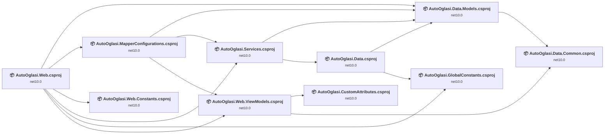

## Project Details

### Data\AutoOglasi.Data.Common\AutoOglasi.Data.Common.csproj

#### Project Info

- **Current Target Framework:** net10.0✅
- **SDK-style**: True
- **Project Kind:** ClassLibrary
- **Dependencies**: 0
- **Dependants**: 2
- **Number of Files**: 1
- **Lines of Code**: 35
- **Estimated LOC to modify**: 0+ (at least 0,0% of the project)

#### Dependency Graph

Legend:
📦 SDK-style project
⚙️ Classic project

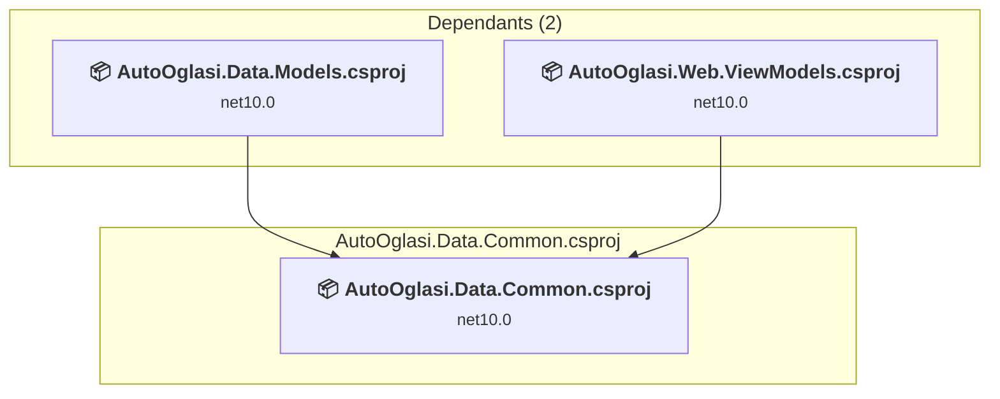

### API Compatibility

| Category | Count | Impact |
| :--- | :---: | :--- |
| 🔴 Binary Incompatible | 0 | High - Require code changes |
| 🟡 Source Incompatible | 0 | Medium - Needs re-compilation and potential conflicting API error fixing |
| 🔵 Behavioral change | 0 | Low - Behavioral changes that may require testing at runtime |
| ✅ Compatible | 0 |  |
| ***Total APIs Analyzed*** | ***0*** |  |

### Data\AutoOglasi.Data.Models\AutoOglasi.Data.Models.csproj

#### Project Info

- **Current Target Framework:** net10.0✅
- **SDK-style**: True
- **Project Kind:** ClassLibrary
- **Dependencies**: 1
- **Dependants**: 4
- **Number of Files**: 13
- **Lines of Code**: 334
- **Estimated LOC to modify**: 0+ (at least 0,0% of the project)

#### Dependency Graph

Legend:
📦 SDK-style project
⚙️ Classic project

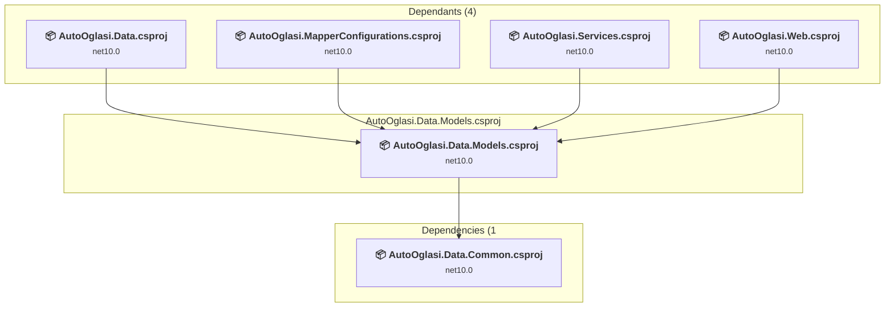

### API Compatibility

| Category | Count | Impact |
| :--- | :---: | :--- |
| 🔴 Binary Incompatible | 0 | High - Require code changes |
| 🟡 Source Incompatible | 0 | Medium - Needs re-compilation and potential conflicting API error fixing |
| 🔵 Behavioral change | 0 | Low - Behavioral changes that may require testing at runtime |
| ✅ Compatible | 0 |  |
| ***Total APIs Analyzed*** | ***0*** |  |

### Data\AutoOglasi.Data\AutoOglasi.Data.csproj

#### Project Info

- **Current Target Framework:** net10.0✅
- **SDK-style**: True
- **Project Kind:** ClassLibrary
- **Dependencies**: 2
- **Dependants**: 1
- **Number of Files**: 29
- **Lines of Code**: 8479
- **Estimated LOC to modify**: 0+ (at least 0,0% of the project)

#### Dependency Graph

Legend:
📦 SDK-style project
⚙️ Classic project

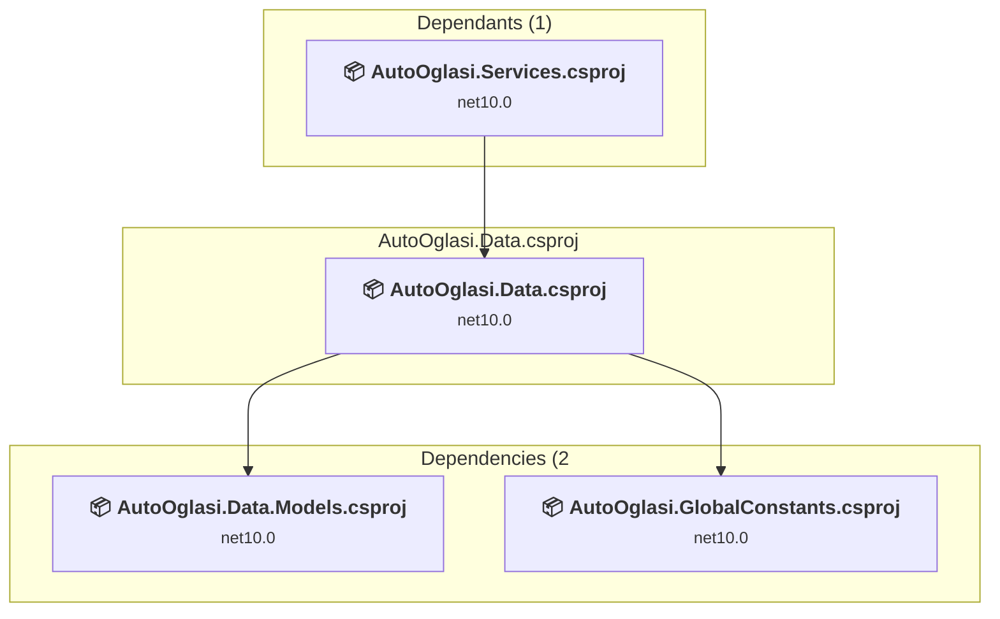

### API Compatibility

| Category | Count | Impact |
| :--- | :---: | :--- |
| 🔴 Binary Incompatible | 0 | High - Require code changes |
| 🟡 Source Incompatible | 0 | Medium - Needs re-compilation and potential conflicting API error fixing |
| 🔵 Behavioral change | 0 | Low - Behavioral changes that may require testing at runtime |
| ✅ Compatible | 0 |  |
| ***Total APIs Analyzed*** | ***0*** |  |

### Infrastructure\AutoOglasi.CustomAttributes\AutoOglasi.CustomAttributes.csproj

#### Project Info

- **Current Target Framework:** net10.0✅
- **SDK-style**: True
- **Project Kind:** ClassLibrary
- **Dependencies**: 0
- **Dependants**: 1
- **Number of Files**: 2
- **Lines of Code**: 25
- **Estimated LOC to modify**: 0+ (at least 0,0% of the project)

#### Dependency Graph

Legend:
📦 SDK-style project
⚙️ Classic project

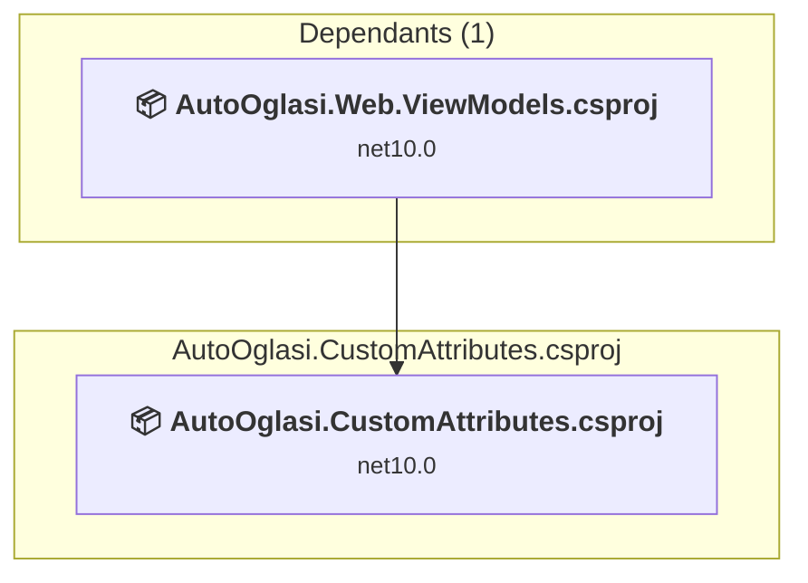

### API Compatibility

| Category | Count | Impact |
| :--- | :---: | :--- |
| 🔴 Binary Incompatible | 0 | High - Require code changes |
| 🟡 Source Incompatible | 0 | Medium - Needs re-compilation and potential conflicting API error fixing |
| 🔵 Behavioral change | 0 | Low - Behavioral changes that may require testing at runtime |
| ✅ Compatible | 0 |  |
| ***Total APIs Analyzed*** | ***0*** |  |

### Infrastructure\AutoOglasi.GlobalConstants\AutoOglasi.GlobalConstants.csproj

#### Project Info

- **Current Target Framework:** net10.0✅
- **SDK-style**: True
- **Project Kind:** ClassLibrary
- **Dependencies**: 0
- **Dependants**: 2
- **Number of Files**: 1
- **Lines of Code**: 7
- **Estimated LOC to modify**: 0+ (at least 0,0% of the project)

#### Dependency Graph

Legend:
📦 SDK-style project
⚙️ Classic project

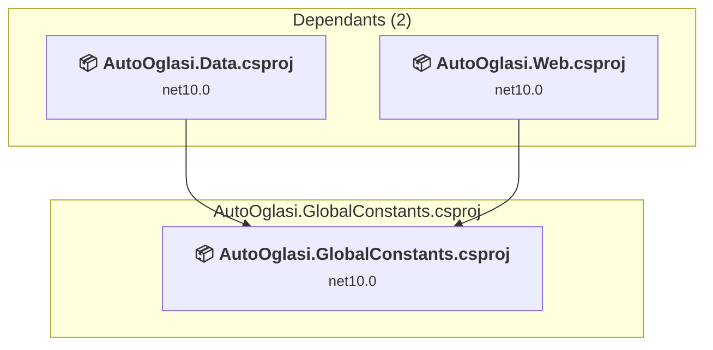

### API Compatibility

| Category | Count | Impact |
| :--- | :---: | :--- |
| 🔴 Binary Incompatible | 0 | High - Require code changes |
| 🟡 Source Incompatible | 0 | Medium - Needs re-compilation and potential conflicting API error fixing |
| 🔵 Behavioral change | 0 | Low - Behavioral changes that may require testing at runtime |
| ✅ Compatible | 0 |  |
| ***Total APIs Analyzed*** | ***0*** |  |

### Infrastructure\AutoOglasi.MapperConfigurations\AutoOglasi.MapperConfigurations.csproj

#### Project Info

- **Current Target Framework:** net10.0✅
- **SDK-style**: True
- **Project Kind:** ClassLibrary
- **Dependencies**: 3
- **Dependants**: 1
- **Number of Files**: 3
- **Lines of Code**: 85
- **Estimated LOC to modify**: 0+ (at least 0,0% of the project)

#### Dependency Graph

Legend:
📦 SDK-style project
⚙️ Classic project

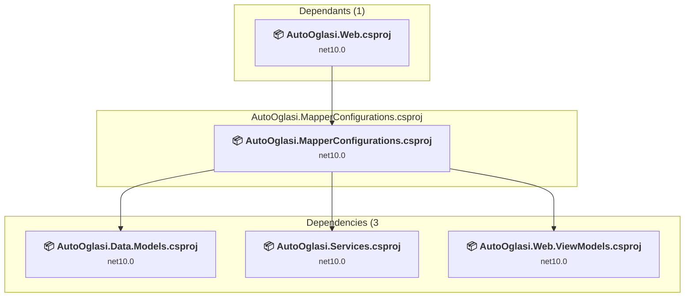

### API Compatibility

| Category | Count | Impact |
| :--- | :---: | :--- |
| 🔴 Binary Incompatible | 0 | High - Require code changes |
| 🟡 Source Incompatible | 0 | Medium - Needs re-compilation and potential conflicting API error fixing |
| 🔵 Behavioral change | 0 | Low - Behavioral changes that may require testing at runtime |
| ✅ Compatible | 0 |  |
| ***Total APIs Analyzed*** | ***0*** |  |

### Services\AutoOglasi.Services\AutoOglasi.Services.csproj

#### Project Info

- **Current Target Framework:** net10.0✅
- **SDK-style**: True
- **Project Kind:** ClassLibrary
- **Dependencies**: 2
- **Dependants**: 2
- **Number of Files**: 31
- **Lines of Code**: 1244
- **Estimated LOC to modify**: 0+ (at least 0,0% of the project)

#### Dependency Graph

Legend:
📦 SDK-style project
⚙️ Classic project

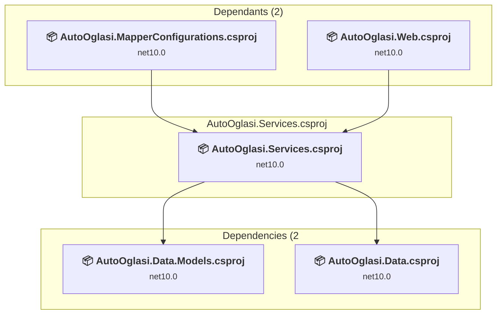

### API Compatibility

| Category | Count | Impact |
| :--- | :---: | :--- |
| 🔴 Binary Incompatible | 0 | High - Require code changes |
| 🟡 Source Incompatible | 0 | Medium - Needs re-compilation and potential conflicting API error fixing |
| 🔵 Behavioral change | 0 | Low - Behavioral changes that may require testing at runtime |
| ✅ Compatible | 0 |  |
| ***Total APIs Analyzed*** | ***0*** |  |

### Web\AutoOglasi.Web.Constants\AutoOglasi.Web.Constants.csproj

#### Project Info

- **Current Target Framework:** net10.0✅
- **SDK-style**: True
- **Project Kind:** ClassLibrary
- **Dependencies**: 0
- **Dependants**: 1
- **Number of Files**: 1
- **Lines of Code**: 10
- **Estimated LOC to modify**: 0+ (at least 0,0% of the project)

#### Dependency Graph

Legend:
📦 SDK-style project
⚙️ Classic project

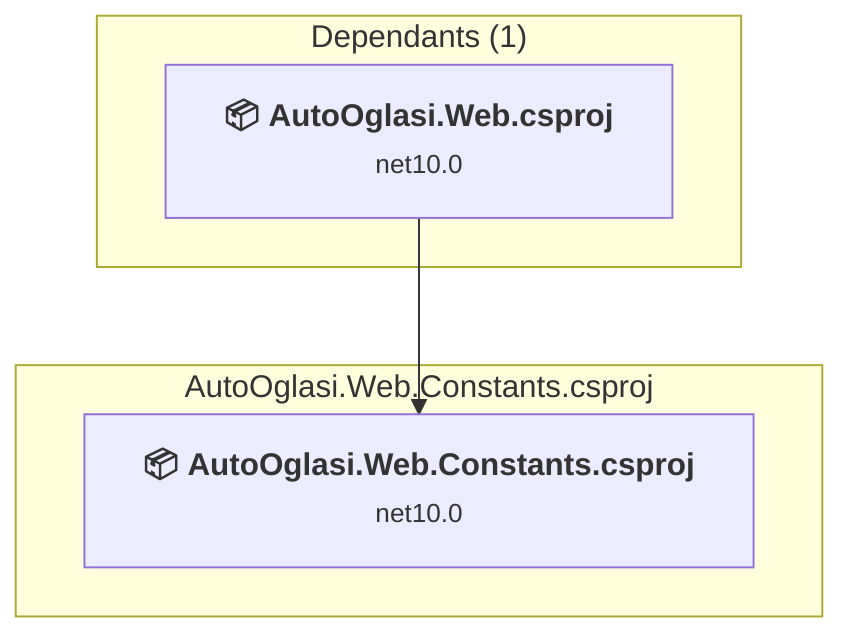

### API Compatibility

| Category | Count | Impact |
| :--- | :---: | :--- |
| 🔴 Binary Incompatible | 0 | High - Require code changes |
| 🟡 Source Incompatible | 0 | Medium - Needs re-compilation and potential conflicting API error fixing |
| 🔵 Behavioral change | 0 | Low - Behavioral changes that may require testing at runtime |
| ✅ Compatible | 0 |  |
| ***Total APIs Analyzed*** | ***0*** |  |

### Web\AutoOglasi.Web.ViewModels\AutoOglasi.Web.ViewModels.csproj

#### Project Info

- **Current Target Framework:** net10.0✅
- **SDK-style**: True
- **Project Kind:** ClassLibrary
- **Dependencies**: 2
- **Dependants**: 2
- **Number of Files**: 71
- **Lines of Code**: 493
- **Estimated LOC to modify**: 0+ (at least 0,0% of the project)

#### Dependency Graph

Legend:
📦 SDK-style project
⚙️ Classic project

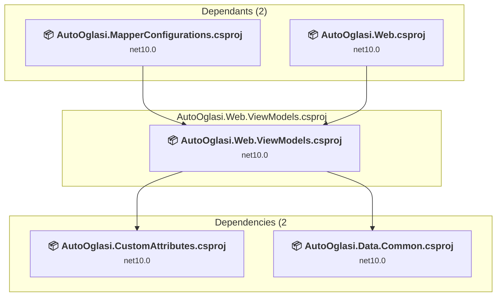

### API Compatibility

| Category | Count | Impact |
| :--- | :---: | :--- |
| 🔴 Binary Incompatible | 0 | High - Require code changes |
| 🟡 Source Incompatible | 0 | Medium - Needs re-compilation and potential conflicting API error fixing |
| 🔵 Behavioral change | 0 | Low - Behavioral changes that may require testing at runtime |
| ✅ Compatible | 0 |  |
| ***Total APIs Analyzed*** | ***0*** |  |

### Web\AutoOglasi.Web\AutoOglasi.Web.csproj

#### Project Info

- **Current Target Framework:** net10.0✅
- **SDK-style**: True
- **Project Kind:** AspNetCore
- **Dependencies**: 6
- **Dependants**: 0
- **Number of Files**: 2306
- **Lines of Code**: 2814
- **Estimated LOC to modify**: 0+ (at least 0,0% of the project)

#### Dependency Graph

Legend:
📦 SDK-style project
⚙️ Classic project

```mermaid
flowchart TB
    subgraph current["AutoOglasi.Web.csproj"]
        MAIN["<b>📦&nbsp;AutoOglasi.Web.csproj</b><br/><small>net10.0</small>"]
        click MAIN "#webautooglasiwebautooglasiwebcsproj"
    end
    subgraph downstream["Dependencies (6"]
        P3["<b>📦&nbsp;AutoOglasi.Data.Models.csproj</b><br/><small>net10.0</small>"]
        P6["<b>📦&nbsp;AutoOglasi.MapperConfigurations.csproj</b><br/><small>net10.0</small>"]
        P9["<b>📦&nbsp;AutoOglasi.Web.Constants.csproj</b><br/><small>net10.0</small>"]
        P7["<b>📦&nbsp;AutoOglasi.Services.csproj</b><br/><small>net10.0</small>"]
        P5["<b>📦&nbsp;AutoOglasi.GlobalConstants.csproj</b><br/><small>net10.0</small>"]
        P10["<b>📦&nbsp;AutoOglasi.Web.ViewModels.csproj</b><br/><small>net10.0</small>"]
        click P3 "#dataautooglasidatamodelsautooglasidatamodelscsproj"
        click P6 "#infrastructureautooglasimapperconfigurationsautooglasimapperconfigurationscsproj"
        click P9 "#webautooglasiwebconstantsautooglasiwebconstantscsproj"
        click P7 "#servicesautooglasiservicesautooglasiservicescsproj"
        click P5 "#infrastructureautooglasiglobalconstantsautooglasiglobalconstantscsproj"
        click P10 "#webautooglasiwebviewmodelsautooglasiwebviewmodelscsproj"
    end
    MAIN --> P3
    MAIN --> P6
    MAIN --> P9
    MAIN --> P7
    MAIN --> P5
    MAIN --> P10

```

### API Compatibility

| Category | Count | Impact |
| :--- | :---: | :--- |
| 🔴 Binary Incompatible | 0 | High - Require code changes |
| 🟡 Source Incompatible | 0 | Medium - Needs re-compilation and potential conflicting API error fixing |
| 🔵 Behavioral change | 0 | Low - Behavioral changes that may require testing at runtime |
| ✅ Compatible | 0 |  |
| ***Total APIs Analyzed*** | ***0*** |  |

